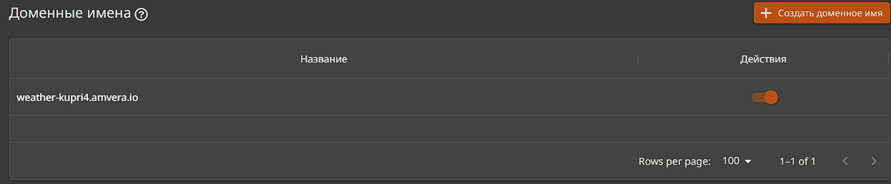

### Публикация приложения Asp.Net Core Blazor приложения + БД PostgreSQL на Amvera

**Цель проекта**: создание web-приложения и последующая его публикация на [Amvera](https://amvera.ru/)

#### Описание проекта
**Тема**: Web-приложение Blazor, предоставляющее возможность извлекать из базы данных информацию о погоде

**Используемые инструменты и технологии:**

**IDE:** Visual Studio 2022 

**Шаблон проекта:** Blazor Web App (Server + WebAssembly)

**Версия .NET:** 8.0

**База данных:** PostgeeSQL

**Исходный код проекта:** [github](https://github.com/Kuprich/AmveraWeather)

### Обзор решения

Склонируйте заранее подготовленный проект командой: 

```$ git clone https://github.com/Kuprich/AmveraWeather```

решение состоит из 2-х проектов и каталога SolutionItems: 

1. AmveraWeather - проект типа Blazor WebServer
1. AmveraWeather.Client - проект типа Blazor WebAssembly


[Подробнее про модели размещения ASP.NET Core Blazor](https://learn.microsoft.com/ru-ru/aspnet/core/blazor/hosting-models?view=aspnetcore-8.0)

**Модель и контекст базы данных**

Содержимое файла *WeatherForecast.cs*, расположенного в каталоге *Models* проекта *"AmveraWeather"*:

```cs
public class WeatherForecast
{
    public Guid Id { get; set; }
    public DateOnly Date { get; set; }
    public int TemperatureC { get; set; }
    public string? Summary { get; set; }
}
```
Содержимое файла *AppDbContext.cs*, расположенного в каталоге *Data* проекта *"AmveraWeather"*:
```c#
public class AppDbContext(DbContextOptions<AppDbContext> options) : DbContext(options)
{
    public DbSet<WeatherForecast> Forecasts { get; set; }
}
```

**Инициализация Базы данных и заполнение её тестовыми данными**

Применение миграций к базе данных и заполнение её тестовыми данными реализовано в статическом классе *DbInitializer*, расположенного в каталоге *Data* проекта *"AmveraWeather"*:

```c#
public static class DbInitializer
{
    public static async Task InitializeDbAsync(AppDbContext dbContext)
    {
        await dbContext.Database.MigrateAsync();

        if (dbContext.Forecasts.Any()) return;

        await dbContext.AddRangeAsync(GetForecasts());
        await dbContext.SaveChangesAsync();
    }

    private static WeatherForecast[] GetForecasts()
    {
        var startDate = DateOnly.FromDateTime(DateTime.Now);
        var summaries = new[] { "Freezing", "Bracing", "Chilly", "Cool", "Mild", "Warm", "Balmy", "Hot", "Sweltering", "Scorching" };
        return Enumerable.Range(1, 5).Select(index => new WeatherForecast
        {
            Date = startDate.AddDays(index),
            TemperatureC = Random.Shared.Next(-20, 55),
            Summary = summaries[Random.Shared.Next(summaries.Length)]
        }).ToArray();
    }
}
```
>***:warning:***: *подробнее по использованию механизма миграций в EF Core: [Обзор миграций](https://learn.microsoft.com/ru-ru/ef/core/managing-schemas/migrations/?tabs=dotnet-core-cli)*

**Подключение к Базе Данных PostgreSQL**

В файле *appsettings.json* проекта *AmveraWether* добавлен параметр "ConnectionStrings": 

```json
{
  "ConnectionStrings": {
    "PostgreeSql": "Server=; Database=; User Id=; Password=;"
  },
  ...
}
```

>***:warning:***: *данный метод определения параметра ConnectionStrings в файле appsettings.json представлен в ознакомительных целях. Данные о подключении к БД следует скрывать, например, используя ["Сейф хранилище секретов приложений в разработке в ASP.NET Core"](https://learn.microsoft.com/ru-ru/aspnet/core/security/app-secrets?view=aspnetcore-8.0&tabs=windows)*

**Создание DockerFile**

Visual Studio предосталяет инструменты генерации DockerFile. С помощью IDE добавлена в проект поддержка Docker, а затем внесены изменения, по итогу, содержимое DockerFile представлено ниже:

```dockerfile
# https://hub.docker.com/_/microsoft-dotnet
FROM mcr.microsoft.com/dotnet/sdk:8.0 AS build
WORKDIR /src

# copy csproj and restore as distinct layers
COPY AmveraWeather/AmveraWeather/*.csproj ./AmveraWeather/AmveraWeather/
COPY AmveraWeather/AmveraWeather.Client/*.csproj ./AmveraWeather/AmveraWeather.Client/
RUN dotnet restore AmveraWeather/AmveraWeather/AmveraWeather.csproj


# copy everything else and build app
COPY . .
WORKDIR /src/AmveraWeather/AmveraWeather
RUN dotnet publish "AmveraWeather.csproj" -c release -o /app/publish

# final stage/image
FROM mcr.microsoft.com/dotnet/aspnet:8.0
WORKDIR /app
COPY --from=build /app/publish .
ENTRYPOINT ["dotnet", "AmveraWeather.dll"]
```
>***:warning:***: *Посетите страницу ["Образы Docker для ASP.NET Core"](https://learn.microsoft.com/ru-ru/aspnet/core/host-and-deploy/docker/building-net-docker-images?view=aspnetcore-8.0) для ознакомления с примерами DockerFile.*


Контекст базы данных "AppdbContext" зарегистрирован как сервис, используя внедрение зависимостей: 

```cs
builder.Services.AddDbContext<AppDbContext>(opt =>
    opt.UseNpgsql(builder.Configuration.GetConnectionString("PostgreeSql"))
);
```
>***:warning:***: *метод AddDbContext поставляется NuGet-пакетом "Microsoft.EntityFrameworkCore"*

>***:warning:***: *метод UseNpgsql поставляется NuGet-пакетом "Npgsql.EntityFrameworkCore.PostgreSQL"*


#### Деплой проекта на Amvera

**Создание проекта. Этап 1**

Перейдите на сайт [Amvera](https://cloud.amvera.ru/), далее в ЛК создайте новый проект типа *"приложение"*, заполнив поля: 
- Название проекта
- Тариф 

>***:warning:***: *для данного проекта достаточно начального тарифного плана, но для решений сложнее, специалисты Amvera рекомендуют выполнить первый запуск с одним и старших тарифов*


**Создание проекта. Этап 2**

Т.к. репозиторий уже инициализирован, следуя подсказкам сервиса подключите проект к удаленному репозиторию командой: 

```$ git remote add amvera https://git.amvera.ru/{имя пользователя}/{имя проекта}```

Далее, отправьте изменения в удаленный репозиторий командой:
```$ git push amvera master```


После загруки кода в удаленный репозиторий начнется сборка проекта, которая завершится с ошибкой. Необходимо выполнить конфигурацию проекта. Перейдите к этапу 3, нажав кнопку *"Далее"*:

**Создание проекта. Этап 3**

- Выберите окружение: *docker*
- Выберите инструмент: *docker*
- Добавьте в паратмерт аргумента порт: *--port 8080*
- Установите порт контейнера со значением: *8080*

Завершите создание проекта. 


>***:warning:***: *[По умолчанию ASP.NET основной порт изменился с 80 по 8080](https://learn.microsoft.com/ru-ru/dotnet/core/compatibility/containers/8.0/aspnet-port)*

>***:warning:***: *Выполняйте команды git, не закрывая окно "Создание проекта", так как задание конфигурации создает коммит в удаленном репозитории, это означает, что понадобится синхронизация удаленного репозитория с имеющимся*


**Внесение изменений в проект:**

По завершении создания проекта, выполните команду 

```$ git pull amvera master``` 

для получения файла *amvera.yml*:

```yml
---
meta:
  environment: docker
  toolchain:
    name: docker
    version: latest
build:
  dockerfile: Dockerfile
  skip: false
run:
  persistenceMount: /data
  containerPort: 8080
  args: --port 8080
```

#### Создание проекта типа PostgreSQL

**Создание проекта типа PostgreSQL. Этап 1.**

На главной странице управления проектами содайте новый проект с типом вервиса *PostgreSQL*: 

- Введите название проекта: *WeatherDb*
- Выберите тарифный план: "Начальный" 

Перейдите далее


**Создание проекта типа PostgreSQL. Этап 2.**

На следующем этапе заполните обязательные поля: 

- Имя создаваемой БД
- Имя пользователя
- Пароль пользователя

Завершите конфигурацию


#### Подключение БД к ранее созданному Blazor приложению

Обновите локальный репозиторий командой: 
```$ git pull amvera master```

После того, как проект типа *PostgreSQL* создан, в разделе *Info* появится 3 варианта доступа:


Скопируйте вариант "№1. Для чтения/записи". Далее, внесите изменения в файл appsettings.json проекта:

-Server - ранее скопированное доменное имя (одно из трех)
- Database - имя ранее созданной БД
- User Id - имя пользователя 

```json
"ConnectionStrings": {
  "PostgreeSql": "Server=amvera-kupri4-cnpg-weatherdb-rw; Database=weatherdb; User Id=amvera; Password=*******;"
}
...
```

>***:warning:***: *[Примеры строк подключения к БД типа postgreSQL](https://www.connectionstrings.com/postgresql/)*

>***:warning:***: *Вносите изменения именно в файл appsettings.json. В проекте имеется файл appsettings.Development.json. ASP.NET Core может настраивать поведение приложения в зависимости от среды выполнения. Подробнее:[Использование нескольких сред в ASP.NET Core](https://learn.microsoft.com/ru-ru/aspnet/core/fundamentals/environments?view=aspnetcore-8.0)*

Создайте коммит:

```$ git commit -a  -m "db connection is configured"```

Отправьте обновленные данные в удаленный репозиторий: 

```$ git push amvera master```

Сборка проекта начнется автоматически, но имеется возможность пересобрать проект.

В разделе *Настройки* основного проекта необходимо активировать доменное имя. Имя третьего уровня генерируется автоматически


>***:warning:***: *Посетите страницу [Сетевое взаимодействие](https://docs.amvera.ru/applications/configuration/network.html#id3) если вы хотите использовать своё доменное имя*


Финальный результат:


